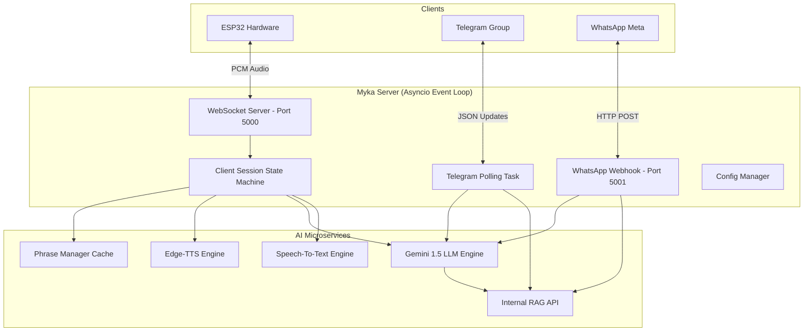

# 1. Tổng quan Kiến trúc Hệ thống (Architecture)

Tài liệu này cung cấp bức tranh toàn cảnh về cách máy chủ AI Myka được thiết kế để xử lý đồng thời đa nền tảng (Omnichannel) với độ trễ thấp nhất.

## Kiến trúc Tổng thể
Máy chủ Myka được viết bằng Python, sử dụng thư viện `asyncio` để tạo ra một Event Loop (Vòng lặp sự kiện) duy nhất. Điều này cho phép máy chủ xử lý hàng ngàn kết nối I/O mà không bị nghẽn (Blocking).

## Các Thành phần Cốt lõi (Core Components)

### 1. `core/client_session.py`
Bộ não điều phối riêng cho phần cứng ESP32. Sử dụng mô hình State Machine với 4 trạng thái:
- **SLEEP**: Đang chờ từ khóa đánh thức (Wake word).
- **WAKE**: Đã được đánh thức, sẵn sàng nhận lệnh.
- **LISTENING**: Đang ghi âm giọng nói người dùng.
- **SPEAKING**: Đang phát âm thanh trả lời xuống ESP32.

### 2. Microservices AI
Hệ thống được chia nhỏ thành các Module độc lập (Decoupled):
- **STT Engine (`stt_engine.py`)**: Nhận diện âm thanh (Google Speech-to-Text).
- **LLM Engine (`llm_engine.py`)**: Sinh văn bản và phân loại cảm xúc bằng Google Gemini.
- **TTS Engine (`tts_engine.py`)**: Trích xuất âm thanh từ Microsoft Edge-TTS, băm nhỏ (chunking) thành PCM 16kHz.
- **RAG Engine (`rag_engine.py`)**: Kết nối với hệ thống RAG nội bộ của công ty.

### 3. Omnichannel Notifiers
- **`telegram_notifier.py`**: Chạy vòng lặp `getUpdates` liên tục (Long Polling) để đọc tin nhắn từ Telegram Group.
- **`whatsapp_notifier.py`**: Chạy một server HTTP phụ (`aiohttp.web`) tại cổng `5001` để nhận Webhook từ nền tảng Meta.
